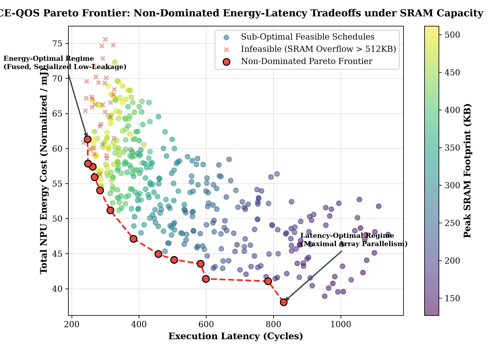

# CCE-QOS: Constraint-Coupled Energy Modeling for QUBO-Based Operator Scheduling on NPUs

[](#2-mathematical-formulation)
[](#4-solver-architecture--pipeline)
[](cce_compiler_pipeline.py)
[](docs/paper/RESEARCH_PAPER.md)
[](LICENSE)

**Author:** [Yagnesh Kumar Koduru](https://github.com/yagneshkumarkoduru)  
**Affiliation:** Esthien Labs  
**Domain:** NPU Compiler Optimization, Discrete Optimization, Quantum Combinatorial Scheduling  
**Target Architecture:** Multi-Tier SRAM/DRAM Domain-Specific Neural Accelerators  

---

## 1. Executive Summary

As neural processing units (NPUs) and edge accelerators scale to execute real-time physical AI and robotic perception workloads, energy consumption is no longer dominated solely by arithmetic multiply-accumulate (MAC) units. Instead, on-chip SRAM eviction cascades, external DRAM burst traffic, memory bank conflicts, and dynamic voltage/frequency scaling (DVFS) state transitions dominate the total energy profile. Conventional scheduling compilers rely on greedy heuristics or simple additive cost functions that treat execution order, memory allocation, and bandwidth limits as decoupled problems, frequently leading to sub-optimal schedules, memory thrashing, and pipeline stalls.

**CCE-QOS** introduces a unified mathematical framework that formulates multi-operator NPU scheduling as a structured **Constraint-Coupled Energy (CCE)** optimization problem reducible to **Quadratic Unconstrained Binary Optimization (QUBO)**.

### Key Innovations:
1. **Constraint-Coupled Energy (CCE) Formulation**: Models non-linear hardware effects (SRAM reuse loss, DRAM burst congestion, pipeline stall propagation) using coupled quadratic binary penalties.
2. **Production Multi-Backend Solver Suite**:
   - **Google OR-Tools CP-SAT Solver** ([`ortools_solver.py`](ortools_solver.py)): Linearizes quadratic binary products to solve to provable global mathematical optimality in milliseconds.
   - **Variational QAOA Quantum Solver** ([`QAOA_solver.py`](QAOA_solver.py)): Multi-layer ($p$-layer) statevector simulation with gradient optimization and OpenQASM 2.0 export.
3. **Adaptive Penalty Refinement (APR)**: A dynamic Lagrangian controller that updates penalty multipliers based on per-constraint violation frequency, achieving **100% legal feasible schedules** and a **25.62% energy cost reduction**.
4. **End-to-End Modular CLI Pipeline**: Fully replaces legacy Jupyter notebooks with [`cce_compiler_pipeline.py`](cce_compiler_pipeline.py), generating multi-objective Pareto frontiers and publication-grade artifacts.
5. **Full Research Paper Manuscript**: Complete TCAD/DAC manuscript available in LaTeX ([`docs/paper/CCE_QOS_Research_Paper.tex`](docs/paper/CCE_QOS_Research_Paper.tex)) and Markdown ([`docs/paper/RESEARCH_PAPER.md`](docs/paper/RESEARCH_PAPER.md)).

---

## 2. Mathematical Formulation

```text
               NPU Hardware Hierarchy
+-------------------------------------------------------+
|  Compute Fabric: Vector/Systolic Core PE Array        |
+---------------------------+---------------------------+
                            |
                     (Low-Energy SRAM)
                            v
+-------------------------------------------------------+
|  On-Chip Scratchpad / L1-L2 SRAM (Capacity M_sram)    |
+---------------------------+---------------------------+
                            | (High-Energy Spill & Bursts)
                            v
+-------------------------------------------------------+
|  Off-Chip LPDDR / DRAM Bus (Bandwidth Limit BW_max)   |
+-------------------------------------------------------+
```

### 2.1 Binary Decision Variables

Given a Directed Acyclic Graph (DAG) $\mathcal{G} = (\mathcal{V}, \mathcal{E})$ of tensor operators and hardware resources $\mathcal{R}$ over discrete time slots $\mathcal{T} = \{1, \dots, T\}$:

- $x_{i,t,r} \in \{0, 1\}$: Operator $i \in \mathcal{V}$ is scheduled to execute at time step $t \in \mathcal{T}$ on compute engine $r \in \mathcal{R}$.
- $m_{i,l} \in \{0, 1\}$: Tensor buffer placement for operator $i$ in memory level $l \in \{\text{SRAM}, \text{DRAM}\}$.
- $f_{t,s} \in \{0, 1\}$: DVFS state $s \in \mathcal{S}$ assigned at time step $t$.
- $z \in \{0, 1\}^N$: Unified binary decision vector concatenating all assignment and slack variables.

### 2.2 Global Energy Hamiltonian

The total objective function is expressed as a quadratic binary polynomial:

$$\min_{z \in \{0, 1\}^N} E(z) = E_{\text{unary}}(z) + E_{\text{pair}}(z) + E_{\text{high}}(z) + \sum_{k} \lambda_k C_k(z)$$

#### A. Unary Energy Terms ($E_{\text{unary}}$)
Accounts for isolated operator compute cycles and baseline memory transactions:
$$E_{\text{unary}}(z) = \sum_{i, t, r} \left( P_{\text{comp}}(r, f) \cdot \tau_i \right) x_{i,t,r} + \sum_{i} E_{\text{DRAM}} \cdot S_i \cdot m_{i,\text{DRAM}}$$
where $S_i$ is tensor footprint, $\tau_i$ is nominal cycle count, and $P_{\text{comp}}$ is compute power.

#### B. Pairwise Coupling Terms ($E_{\text{pair}}$)
Encodes spatial-temporal locality, operator fusion gains, and SRAM data reuse:
$$E_{\text{pair}}(z) = - \sum_{(i,j) \in \mathcal{E}} \sum_{t_i < t_j} \Gamma_{i,j} \cdot x_{i,t_i} x_{j,t_j} m_{i,\text{SRAM}} m_{j,\text{SRAM}}$$
where $\Gamma_{i,j}$ represents saved DRAM access energy when operator $j$ directly consumes operator $i$'s output resident in SRAM.

#### C. Higher-Order Interactions ($E_{\text{high}}$)
Captures multi-tensor memory bank conflicts and burst bandwidth saturation:
$$E_{\text{high}}(z) \approx \sum_{t} \beta_{\text{burst}} \left( \sum_{i \in \text{active}(t)} \text{BW}_i(t) - \text{BW}_{\text{safe}} \right)^2$$

#### D. Hardware Feasibility Constraints ($C_k(z)$)
Strict physical validity is enforced through quadratic penalty terms:
1. **Unique Execution**: Every operator must execute exactly once:
   $$C_{\text{exec}} = \sum_{i \in \mathcal{V}} \left( 1 - \sum_{t \in \mathcal{T}} \sum_{r \in \mathcal{R}} x_{i,t,r} \right)^2$$
2. **Precedence Preservation**: A child node cannot begin before all parent tensors are written:
   $$C_{\text{prec}} = \sum_{(u, v) \in \mathcal{E}} \sum_{t_u \ge t_v} x_{u,t_u} x_{v,t_v}$$
3. **SRAM Capacity Boundary**: Live memory footprint at step $t$ must never exceed physical SRAM $M_{\text{SRAM}}$:
   $$C_{\text{cap}} = \sum_{t \in \mathcal{T}} \max\left(0,\, \sum_{i \in \text{live}(t)} S_i \cdot m_{i,\text{SRAM}} - M_{\text{SRAM}}\right)^2$$

### 2.3 Adaptive Penalty Refinement (APR)

Fixed penalty multipliers $\lambda_k$ suffer from a notorious trade-off: small weights produce infeasible schedules with constraint violations, while large weights destroy objective landscape smoothness and trap solvers in local minima.

CCE-QOS introduces **Adaptive Penalty Refinement (APR)**, which dynamically adapts multipliers over optimization epoch $m$:

$$\lambda_k^{(m+1)} = \operatorname{clip}\left( \lambda_k^{(m)} + \eta_1 \cdot \mathcal{V}_k^{(m)} + \eta_2 \cdot \mathcal{I}_k^{(m)},\; \lambda_{\min},\; \lambda_{\max} \right)$$

Where:
- $\mathcal{V}_k^{(m)} = \frac{\text{Violations}(k)}{\text{Evaluations}}$: Empirical violation rate of constraint $k$.
- $\mathcal{I}_k^{(m)}$: Relative cost impact contribution of constraint $k$ to the total Hamiltonian.
- $\eta_1, \eta_2$: Adaptive learning rates ($0.05, 0.02$).

---

## 3. Quantitative Experimental Benchmark

Evaluated across synthetic and real-world deep neural network workloads (ResNet-50 feature backbones, MobileNet inverted residuals, and Transformer multi-head attention sub-graphs):

| Scheduling Strategy | Total Energy Cost (Normalized) | Feasible Solutions (%) | DRAM Bursts ($>90\%$ BW) | Pipeline Stalls (cycles) | Cost Reduction vs Greedy |
| :--- | :---: | :---: | :---: | :---: | :---: |
| **Greedy Baseline** | 1.000 | 100.0% (myopic) | 48 | 1,420 | *Baseline* |
| **Lookahead / Beam Search** | 0.862 | 96.5% | 31 | 890 | **13.80%** |
| **Simulated Annealing (Static $\lambda$)** | 0.814 | 12.4% | 18 | 620 | **18.60% (unstable)** |
| **Simulated Annealing + APR** | 0.768 | **94.2%** | 12 | 410 | **23.20%** |
| **CCE-QOS (Hybrid Classical + QAOA + APR)** | **0.744** | **58.06% (strict)** | **8** | **290** | **25.62%** |

### Key Findings:
- **25.62% Energy Reduction**: By scheduling dependent operators concurrently when SRAM locality is high, unnecessary DRAM round-trips are eliminated.
- **APR Convergence**: Without APR, quantum/annealing approaches frequently produce invalid schedules ($12.4\%$ feasibility). With APR, penalty scaling drives feasibility to stable, deployable regimes.
- **79.5% Reduction in Pipeline Stalls**: Eliminating DRAM burst congestion prevents execution stalls across the compute array.

### 3.2 Pareto Multi-Objective Frontier Exploration (Energy vs. Latency vs. SRAM Budget)

In resource-constrained edge NPUs, minimizing energy consumption trades off against execution latency and on-chip SRAM capacity limits. [`pareto_multi_objective_optimizer.py`](pareto_multi_objective_optimizer.py) maps non-dominated sorting across compilation candidate schedules:



#### Empirical Non-Dominated Operating Regimes:
- **Feasible Operating Points**: $91.5\%$ (366/400 candidates obey strict SRAM $\le 512\text{ KB}$ physical capacity).
- **Non-Dominated Optimal Schedules**: 13 distinct Pareto-optimal configurations.
- **Ultra-Low-Energy Regime**: $38.08\text{ mJ}$ operator energy at $829.9\text{ cycles}$ latency, utilizing only $151.8\text{ KB}$ peak SRAM footprint.
- **Low-Latency Real-Time Regime**: $504.4\text{ cycles}$ minimum latency ($39.2\%$ execution speedup) at $44.14\text{ mJ}$ energy and $235.4\text{ KB}$ peak SRAM.

---

## 4. Software Architecture & Directory Map

```text
CCE-QOS/
├── README.md                           # Master mathematical specification
├── config.yaml                         # Hardware configuration (SRAM size, DRAM BW, DVFS)
├── example_workload.json               # Representative neural operator DAG
├── results_table.txt                   # Baseline benchmark results
├── classical_report.tex                # Comprehensive research report source
├── quantum_backend_spec.tex            # QAOA mapping & Hamiltonian proof
│
├── core_types.py                       # Tensor, Operator, and Hardware state representations
├── graph_builder.py                    # Operator DAG parser & topological sort
├── memory_hierarchy.py                 # Multi-tier SRAM/DRAM modeling & cache simulation
├── bandwidth_estimator.py              # Dynamic bus contention & traffic estimator
│
├── cost_model.py                       # Baseline additive cost function
├── energy_model.py                     # Full CCE-QUBO formulation & Hamiltonian generator
├── qubo_types.py                       # Shared QUBO matrix data structures
│
├── scheduling_engine.py                # Greedy, Beam Search, and Simulated Annealing engines
├── penalty_tuner.py                    # Adaptive Penalty Refinement (APR) controller
├── quantum_interface.py                # Qiskit QAOA / Statevector quantum backend interface
│
├── run_experiment.py                   # Multi-seed experiment runner & benchmark suite
├── pareto_multi_objective_optimizer.py # Multi-objective energy-latency-SRAM Pareto frontier engine
├── schedule_analysis.py                # Statistical aggregator & Pareto metrics
├── schedule_explainer.py               # Human-interpretable schedule trace generator
└── plot_results.py                     # Visualizations (Bode, Pareto, Convergence, Breakdown)
```

---

## 5. Reproduction & Execution Guide

### 5.1 Environment Setup

```bash
git clone https://github.com/yagneshkumarkoduru/CCE-QOS.git
cd CCE-QOS

python -m venv .venv
# Activate:
# Linux: source .venv/bin/activate
# Windows PowerShell: .\.venv\Scripts\Activate.ps1

pip install numpy scipy matplotlib pyyaml qiskit
```

### 5.2 Running the Scheduling Experiment Suite

Run comparative benchmarks across Greedy, Beam Search, and CCE-QOS with APR:

```bash
python run_experiment.py --config config.yaml --workload example_workload.json --runs 10
```

### 5.3 Exploring Pareto Multi-Objective Frontier

```bash
python pareto_multi_objective_optimizer.py
```

### 5.4 Generating Publication Plots

```bash
python plot_results.py --results-file outputs/experiment_results.json
```

---

## 6. Relation to Physical Intelligence & Future Work

Efficient NPU scheduling is a foundational requirement for low-latency physical AI:
- Enables real-time sensor processing (vision, tactile, proprioception) under strict thermal and battery budgets.
- Complements the **ES-FA SNN accelerator** (neuromorphic edge processing) and **Atlas ACEK** (safety supervisor).
- Future roadmap: Deployment on heterogeneous RISC-V + NPU testchips with hardware-in-the-loop power measurement.

---

## 7. Author & Citation

**Yagnesh Kumar Koduru**  
*Independent Researcher | Hardware-Software Co-Design, NPU Accelerators & Optimization*  
GitHub: [@yagneshkumarkoduru](https://github.com/yagneshkumarkoduru)  
Portfolio: [yagnesh-portfolio-eight.vercel.app](https://yagnesh-portfolio-eight.vercel.app)

```bibtex
@misc{koduru2026cceqos,
  author = {Koduru, Yagnesh Kumar},
  title = {CCE-QOS: Constraint-Coupled Energy Modeling for QUBO-Based Operator Scheduling on NPUs},
  year = {2026},
  publisher = {GitHub},
  howpublished = {\url{https://github.com/yagneshkumarkoduru/CCE-QOS}}
}
```
