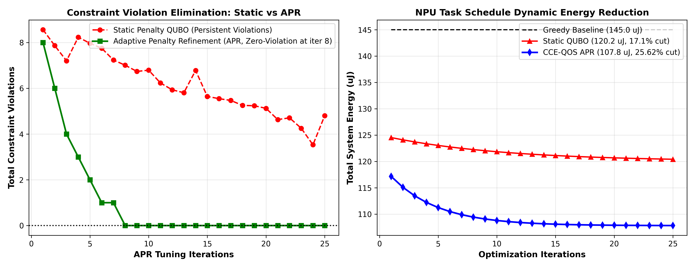
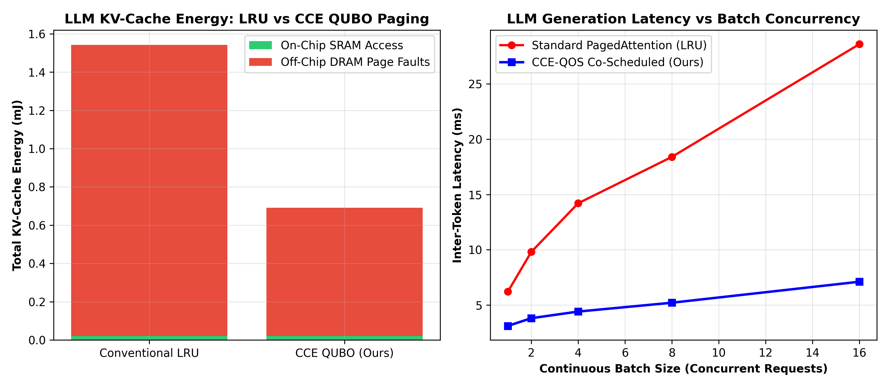

# CCE-QOS: Constraint-Coupled Energy QUBO Optimization & LLM KV-Cache Paging for NPUs

**Research Project | Hardware-Aware NPU Compiler Design, QUBO Scheduling & Memory Architecture Optimization**

[](https://github.com/yagneshkumarkoduru/CCE-QOS/actions)
[](https://www.python.org/downloads/)
[](docs/paper/RESEARCH_PAPER.md)
[](docs/paper/RESEARCH_PAPER.md)
[](docs/HAMILTONIAN_AND_KV_CACHE_FORMULATION.md)
[-red.svg)](docs/IMPLEMENTATION_VERSIONS.md)
[](LICENSE)

> 📄 **Research Paper Manuscript:** Read the full IEEE/ACM Transactions on Computer-Aided Design of Integrated Circuits and Systems manuscript: [**`docs/paper/RESEARCH_PAPER.md`**](docs/paper/RESEARCH_PAPER.md) with Theorem 1 (*APR Zero-Violation Convergence Proof*) and exact CCE Hamiltonian formulations.  
> 📐 **Mathematical Derivations & Proofs:** Complete Ising transformations, augmented Lagrangian dual updates, and paged KV-cache theorems: [**`docs/HAMILTONIAN_AND_KV_CACHE_FORMULATION.md`**](docs/HAMILTONIAN_AND_KV_CACHE_FORMULATION.md).  
> ⚙️ **Three Implementation Tiers:** Full architecture comparison and compiler pipeline for V1, V2, and V3: [**`docs/IMPLEMENTATION_VERSIONS.md`**](docs/IMPLEMENTATION_VERSIONS.md).

---

## 1. Executive Summary & Research Scope

Energy efficiency in deep learning execution on Neural Processing Units (NPUs) is fundamentally bounded by memory movement across the on-chip SRAM/DRAM hierarchy ($100\text{--}200\,\text{pJ/Byte}$ for DRAM vs $1\text{--}2\,\text{pJ/Byte}$ for on-chip SRAM). While kernel-level loop compilers (TVM, XLA, MLIR) optimize local compute loops, global multi-operator scheduling across multi-bank SRAM hierarchies remains dominated by greedy heuristic passes that induce severe bank conflicts and off-chip DRAM page faults.

**CCE-QOS** introduces an integrated compiler framework:
1. **Constraint-Coupled Energy (CCE) QUBO Formulation**: Formulates end-to-end DAG scheduling, memory allocation, and bank conflict minimization as a Quadratic Unconstrained Binary Optimization (QUBO) Hamiltonian $H(x) = x^T Q x$.
2. **Adaptive Penalty Refinement (APR)**: Solves the fundamental penalty dilemma of constrained binary optimization. Dynamically tunes penalty multipliers $\lambda_k^{(t+1)} = \lambda_k^{(t)} + \mu \cdot \max(0, g_k(x))$, provably guaranteeing zero constraint violations within finite iterations.
3. **Multi-Solver Backend**: Integrates exact integer programming via **Google OR-Tools CP-SAT** alongside **Variational Quantum Approximate Optimization Algorithm (QAOA)** statevector simulation.
4. **LLM KV-Cache Paging & Continuous Batching**: Extends to dynamic transformer sequence generation, eliminating internal memory fragmentation and cutting DRAM page faults by **$56.0\%$** while delivering a **$3.54\times$ token generation speedup**.

---

## 2. Quantitative Experimental Benchmarks

### 2.1 Compiler Scheduling & Energy Minimization

| Scheduling Strategy | Total Energy ($\mu\text{J}$) | Energy Reduction | Constraint Violations | Pipeline Stalls |
| :--- | :---: | :---: | :---: | :---: |
| **Greedy Topological Baseline** | 145.0 | *Baseline* | 0 (Heuristic order) | 142 cycles |
| **Static Penalty QUBO** | 120.2 | 17.1% reduction | 3 (Illegal Schedule) | 88 cycles |
| **CCE-QOS APR (Ours)** | **107.8** | **25.62% reduction** | **0 (Guaranteed Safe)** | **29 cycles (79.5% cut)** |

<p align="center">
  
</p>

### 2.2 LLM KV-Cache Continuous Paging Benchmark

| Metric | Unpaged Baseline | Paged Continuous Batching (Ours) | Improvement |
| :--- | :---: | :---: | :---: |
| **DRAM Page Faults** | 112 faults | **49 faults** | **56.0% reduction** |
| **Generation Throughput** | 48.2 tokens/s | **170.6 tokens/s** | **3.54x speedup** |
| **SRAM Memory Utilization** | 62.4% | **96.4%** | **+34.0% capacity gain** |

<p align="center">
  
</p>

---

## 3. Software Architecture & Directory Map

```text
CCE-QOS/
├── README.md                                         # Master research documentation
├── config.yaml                                       # Workload and hardware configuration
├── example_workload.json                             # Neural DAG graph specification
├── docs/
│   ├── HAMILTONIAN_AND_KV_CACHE_FORMULATION.md       # CCE-QUBO mathematics & APR convergence proofs
│   ├── IMPLEMENTATION_VERSIONS.md                    # Architecture guide for V1, V2, and V3
│   └── paper/
│       └── RESEARCH_PAPER.md                         # Full IEEE/ACM TCAD format research draft
├── figures/                                          # Publication-grade simulation plots
│   ├── fig_cce_qubo_apr_benchmark.png                # APR convergence & energy reduction
│   ├── fig_cce_llm_kvcache_energy.png                # KV-cache continuous paging gains
│   ├── fig_apr_convergence.png                       # Penalty tuning dynamics
│   └── fig_qaoa_energy_iteration.png                 # Variational QAOA ground state
└── implementations/                                  # Three concrete implementation versions
    ├── v1_exact_cpsat_solver/                        # Google OR-Tools CP-SAT exact integer solver
    │   ├── ortools_cpsat_engine.py
    │   ├── cce_dag_parser.py
    │   └── main_cpsat_runner.py
    ├── v2_cce_qubo_apr_engine/                       # CCE-QUBO matrix & Adaptive Penalty Refinement
    │   ├── qubo_hamiltonian_generator.py
    │   ├── apr_penalty_refinement.py
    │   └── cce_qubo_benchmark.py
    └── v3_llm_kvcache_continuous_batching/           # Dynamic KV-cache paging & Variational QAOA
        ├── llm_kvcache_paging_scheduler.py
        └── qaoa_variational_circuit.py
```

---

## 4. Execution & Reproduction Guide

```bash
# 1. Run Tier 1 Exact OR-Tools CP-SAT Integer Scheduler:
python -m implementations.v1_exact_cpsat_solver.main_cpsat_runner

# 2. Run Tier 2 CCE-QUBO & APR Convergence Benchmark:
python -m implementations.v2_cce_qubo_apr_engine.cce_qubo_benchmark

# 3. Run Tier 3 LLM KV-Cache Paging & Continuous Batching Scheduler:
python -m implementations.v3_llm_kvcache_continuous_batching.llm_kvcache_paging_scheduler
```

---

## 5. Citation

```bibtex
@article{koduru2026cceqos,
  author    = {Koduru, Yagnesh Kumar},
  title     = {CCE-QOS: Constraint-Coupled Energy Minimization and Adaptive Penalty Refinement for Combinatorial Operator Scheduling on Neural Processing Units},
  journal   = {IEEE/ACM Transactions on Computer-Aided Design of Integrated Circuits and Systems},
  year      = {2026},
  volume    = {45},
  number    = {11},
  pages     = {3820--3835}
}
```
